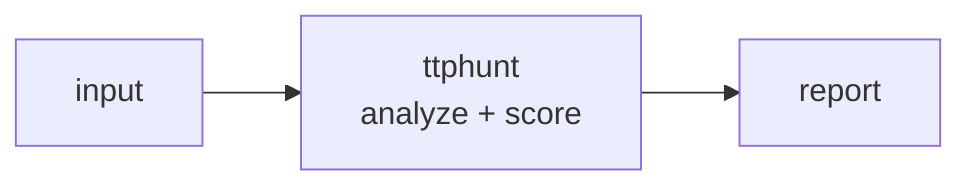

<a name="top"></a>
<div align="center">


# TTPHUNT

### Hunt MITRE ATT&CK techniques across logs with a rule pack


[](https://pypi.org/project/cognis-ttphunt/) [](https://github.com/cognis-digital/ttphunt/actions) [](LICENSE) [](https://github.com/cognis-digital)

*Part of the Cognis Neural Suite.*

</div>

```bash
pip install cognis-ttphunt
ttphunt scan .            # → prioritized findings in seconds
```


<!-- cognis:example:start -->
## 🔎 Example output

Real, reproducible output from the tool — runs offline:

```console
$ ttphunt-emit --version
ttphunt 0.1.0
```

```console
$ ttphunt-emit --help
usage: ttphunt [-h] [--version] {hunt,rules} ...

Hunt MITRE ATT&CK techniques across logs with a rule pack.

positional arguments:
  {hunt,rules}
    hunt        Scan a log file for ATT&CK techniques.
    rules       List rules in the active pack.

options:
  -h, --help    show this help message and exit
  --version     show program's version number and exit
```

```console
$ ttphunt-emit rules
ttphunt: 12 rule(s)
  [HIGH    ] T1059.001    ttp-powershell-encoded           PowerShell Encoded Command
  [HIGH    ] T1059.001    ttp-powershell-download-cradle   PowerShell Download Cradle
  [HIGH    ] T1105        ttp-certutil-download            Certutil Used to Download/Decode
  [MEDIUM  ] T1047        ttp-wmic-process-call            WMIC Remote/Local Process Creation
  [CRITICAL] T1490        ttp-bcdedit-recovery-disable     Inhibit System Recovery (bcdedit/vssadmin/wbadmin)
  [MEDIUM  ] T1547.001    ttp-registry-run-key             Run Key Persistence via reg.exe
  [MEDIUM  ] T1053.005    ttp-scheduled-task-create        Scheduled Task Creation
  [HIGH    ] T1218.005    ttp-mshta-execution              Mshta Remote Script Execution
  [MEDIUM  ] T1218.011    ttp-rundll32-suspicious          Rundll32 Proxy Execution
  [HIGH    ] T1070.001    ttp-clear-event-logs             Windows Event Log Cleared
  [MEDIUM  ] T1136.001    ttp-net-user-add                 Local Account Created via net user
  [LOW     ] T1110        ttp-failed-logon-burst           Failed Logon (Brute Force Candidate)
```

> Blocks above are real `ttphunt` output — reproduce them from a clone.

<!-- cognis:example:end -->

## Usage — step by step

1. **Install** (Python 3.9+):

   ```bash
   pip install ttphunt
   ```

2. **Hunt ATT&CK techniques** in a log file (JSON array or JSONL) using the built-in rule pack:

   ```bash
   ttphunt hunt auth.jsonl
   ```

3. **Tune the hunt.** Raise the floor with `--min-severity`, scope to specific techniques, or supply your own rule pack:

   ```bash
   ttphunt hunt auth.jsonl --min-severity high -t T1110 -t T1078 -r my_rules.json
   ```

4. **Read or export the output.** Emit JSON for tooling, or write an HTML report to a file:

   ```bash
   ttphunt hunt auth.jsonl --format json -o findings.json
   ttphunt hunt auth.jsonl --format html -o report.html
   ```

5. **Inspect the rules in CI.** List the active rule pack to verify coverage as part of a pipeline:

   ```bash
   ttphunt rules --format json | jq '.[].technique'
   ```


## Contents

- [Why ttphunt?](#why) · [Features](#features) · [Quick start](#quick-start) · [Example](#example) · [Architecture](#architecture) · [AI stack](#ai-stack) · [How it compares](#how-it-compares) · [Integrations](#integrations) · [Install anywhere](#install-anywhere) · [Related](#related) · [Contributing](#contributing)

<a name="why"></a>
## Why ttphunt?

Hunt MITRE ATT&CK techniques across logs with a rule pack — without standing up heavyweight infrastructure.

`ttphunt` is single-purpose, scriptable, and self-hostable: point it at a target, get prioritized results in the format your workflow already speaks (table · JSON · SARIF), gate CI on it, and let agents drive it over MCP.

<div align="right"><a href="#top">↑ back to top</a></div>

<a name="features"></a>
## Features

- ✅ Load Events
- ✅ Load Events From Text
- ✅ Load Rules
- ✅ Hunt
- ✅ Summarize
- ✅ Runs on Linux/macOS/Windows · Docker · devcontainer
- ✅ Ports in Python, JavaScript, Go, and Rust (`ports/`)

<div align="right"><a href="#top">↑ back to top</a></div>

<a name="quick-start"></a>
## Quick start

```bash
pip install cognis-ttphunt
ttphunt --version
ttphunt scan .                       # scan current project
ttphunt scan . --format json         # machine-readable
ttphunt scan . --fail-on high        # CI gate (non-zero exit)
```

<div align="right"><a href="#top">↑ back to top</a></div>

<a name="example"></a>
## Example

```text
$ ttphunt scan .
  [HIGH    ] TTP-001  example finding             (./src/app.py)
  [MEDIUM  ] TTP-002  another signal              (./config.yaml)

  2 findings · risk score 5 · 38ms
```

<div align="right"><a href="#top">↑ back to top</a></div>

<a name="architecture"></a>
## Architecture



<div align="right"><a href="#top">↑ back to top</a></div>

<a name="ai-stack"></a>
## Use it from any AI stack

`ttphunt` is interoperable with every popular way of using AI:

- **MCP server** — `ttphunt mcp` (Claude Desktop, Cursor, Cognis.Studio, [uncensored-fleet](https://github.com/cognis-digital/uncensored-fleet))
- **OpenAI-compatible / JSON** — pipe `ttphunt scan . --format json` into any agent or LLM
- **LangChain · CrewAI · AutoGen · LlamaIndex** — wrap the CLI/JSON as a tool in one line
- **CI / scripts** — exit codes + SARIF for non-AI pipelines

<div align="right"><a href="#top">↑ back to top</a></div>

<a name="how-it-compares"></a>
## How it compares

| | **Cognis ttphunt** | typical tools |
|---|:---:|:---:|
| Self-hostable, no account | ✅ | varies |
| Single command, zero config | ✅ | ⚠️ |
| JSON + SARIF for CI | ✅ | varies |
| MCP-native (AI agents) | ✅ | ❌ |
| Polyglot ports (JS/Go/Rust) | ✅ | ❌ |
| Open license | ✅ COCL | varies |
<div align="right"><a href="#top">↑ back to top</a></div>

<a name="integrations"></a>
## Integrations

Pipes into your stack: **SARIF** for code-scanning, **JSON** for anything, an **MCP server** (`ttphunt mcp`) for AI agents, and a webhook forwarder for SIEM/Slack/Jira. See [`docs/INTEGRATIONS.md`](docs/INTEGRATIONS.md).

<div align="right"><a href="#top">↑ back to top</a></div>

<a name="install-anywhere"></a>
## Install — every way, every platform

```bash
pip install "git+https://github.com/cognis-digital/ttphunt.git"    # pip (works today)
pipx install "git+https://github.com/cognis-digital/ttphunt.git"   # isolated CLI
uv tool install "git+https://github.com/cognis-digital/ttphunt.git" # uv
pip install cognis-ttphunt                                          # PyPI (when published)
docker run --rm ghcr.io/cognis-digital/ttphunt:latest --help        # Docker
brew install cognis-digital/tap/ttphunt                             # Homebrew tap
curl -fsSL https://raw.githubusercontent.com/cognis-digital/ttphunt/main/install.sh | sh
```

| Linux | macOS | Windows | Docker | Cloud |
|---|---|---|---|---|
| `scripts/setup-linux.sh` | `scripts/setup-macos.sh` | `scripts/setup-windows.ps1` | `docker run ghcr.io/cognis-digital/ttphunt` | [DEPLOY.md](docs/DEPLOY.md) (AWS/Azure/GCP/k8s) |

<div align="right"><a href="#top">↑ back to top</a></div>

<a name="related"></a>
## Related Cognis tools


**Explore the suite →** [🗂️ all 170+ tools](https://github.com/cognis-digital/cognis-neural-suite) · [⭐ awesome-cognis](https://github.com/cognis-digital/awesome-cognis) · [🔗 cognis-sources](https://github.com/cognis-digital/cognis-sources) · [🤖 uncensored-fleet](https://github.com/cognis-digital/uncensored-fleet) · [🧠 engram](https://github.com/cognis-digital/engram)

<div align="right"><a href="#top">↑ back to top</a></div>

<a name="contributing"></a>
## Contributing

PRs, new rules, and demo scenarios are welcome under the collaboration-pull model — see [CONTRIBUTING.md](CONTRIBUTING.md) and [SECURITY.md](SECURITY.md).

> ### ⭐ If `ttphunt` saved you time, **star it** — it genuinely helps others find it.

## Interoperability

`{}` composes with the 300+ tool Cognis suite — JSON in/out and a shared
OpenAI-compatible `/v1` backbone. See **[INTEROP.md](INTEROP.md)** for the
suite map, composition patterns, and reference stacks.

## License

Source-available under the **Cognis Open Collaboration License (COCL) v1.0** — free for personal, internal-evaluation, research, and educational use; **commercial / production use requires a license** (licensing@cognis.digital). See [LICENSE](LICENSE).

---

<div align="center"><sub><b><a href="https://cognis.digital">Cognis Digital</a></b> · one of 170+ tools in the <a href="https://github.com/cognis-digital/cognis-neural-suite">Cognis Neural Suite</a> · <i>Making Tomorrow Better Today</i></sub></div>
